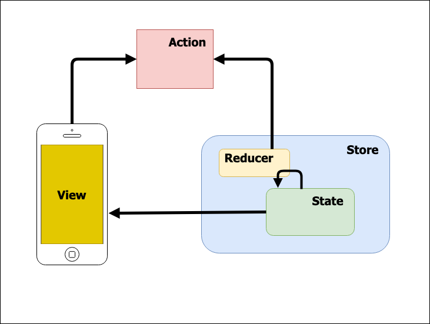
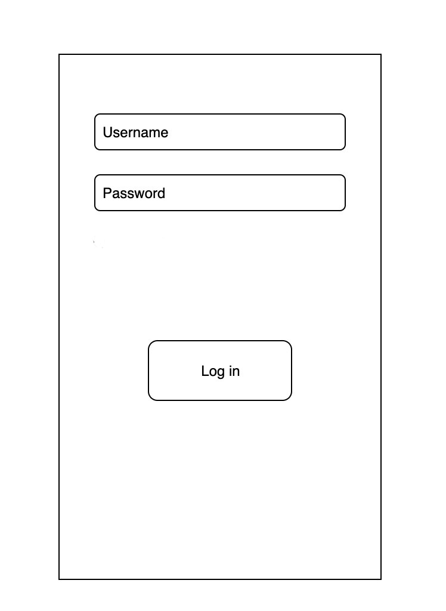
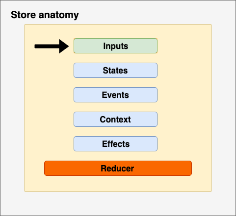

# between all the possibleSensor Architecture

## A solid architecture for iOS app

The concept behind the react architecture is the state machine, or rather,  an abstract machine that can be in exactly one of a finite number of states at any given time. 

A state is a description of the status of a system that is waiting to execute a transition. A transition is a set of actions to be executed when a condition is fulfilled or when an event is received. 

<center>![state machine]</center>

<center>Figure 1. A state diagram of a state machine</center>

The above diagram is a State Diagram of a simple state machine, which depicts how the machine transits between all  possible states depending on the input action (t1, t3). 
When an action is provided to a state it moves to a different state and executes an effect. An effect can be a remote invocation or a local task, as a result of the effect execution.

To move from a state to another, we use an event. An event (or input event) is an action that can happen as a reaction to input. An event can be synchronous or asynchronous. it is *synchronous* when it happens immediately after input, for instance, a button pressed, a pull to refresh, a switch changed. It is *asynchronous* when it happens as a response to an asynchronous call, for instance, a REST API call made against a service. In both cases, it could potentially allows the State Machine to change its state, as we could also stay in the current state. 

Let’s say we have a simple view with a button and a hidden label which is shown when the button is pressed, so we can define two different states: 

- initial state: button enabled, label hidden. 
- Show label state: button pressed, label shown. 

In the next section we will present how we modelled our Sensor architecture using a state machine, showing how it does change from a state to another and finally how these state changes affect a user interface. 

------

### Introducing Sensor

Sensor is built with an [MVVM](https://en.wikipedia.org/wiki/Model–view–viewmodel) architecture, where all the business logic is inside the ViewModel (also called as Store) and the UI in the View, this also makes easy to test and mock all the core functionalities.

<center>![Sensor]</center>

<center>Figure 2. Sensor architecture</center>

The above figure shows the basic Sensor architecture. The figure introduces a main difference between a Redux style architecture and Sensor, which is the use of the so called *Feedback Loop* instead of *middleware*. Both are different ways to do asynchronous operations based on an action. 

The following are the main benefit of using Sensor: 

- a simple View, it contains only the logic to build it up and a simple logic to react to the state changes and send the input back to Store. 
- The business login is separated from UI. 
- The reducer, is a pure-function, easy to test. 

<center>![A Feedback Loop]</center>

<center>Figure 3. How RxFeedback implements feedback loops. Copyright (c) 2017 Krunoslav Zaher</center>


The mechanism of the Feedback Loop is provided by a third party library called [RxFeedback](https://github.com/NoTests/RxFeedback.swift) which provide a way to execute an effect (a side-effect), asynchronous or synchronous, and get an event as a result back to the reducer. I’m not going deep with RxFeedback, you can read more on how it works tapping on the above link.

When we thought on how to write a side-effect we followed the principle of Clean Code which suggest to implement it as a Use Case. [As per high level definition](https://en.wikipedia.org/wiki/Use_case), *a use case is a list of actions or events defining the interaction between an actor and a system to achieve a goal*. In other words, we can think of it as a list of actions we need to perform to get and set some data from and to a remote service. We will see later how the use case are implemented. 

------

## How to model a feature with Sensor

To show an example on how to use Sensor, let us pretend we want to solve a common problem: implement a login screen.

<center>![The mockup]</center>

<center>Figure 3. Mockup of the test app</center>


### Build the (reactive) UI

We start by creating a view of the feature, as mentioned above, we have a simple UI with two text fields, username e password and a button to perform the login. The first we do, is to identify two different entities: 

1. a **Model** object, which store information used to configure the view. 
2. An **Outputs** object, used to collect all the fields needed to connect the UI components to the outside, in a way that they can notify when a value change (character typed inside a text field) or a state change (button pressed). 

In our case we have the following: 

```swift
final class LoginView: UIView {

    struct Model: Equatable {
        let isLoginButtonEnabled: Bool
        let isSpinning: Bool
    }

    struct Outputs {
        let usernameField: Signal<String>
        let passwordField: Signal<String>
        let loginButton: Signal<Void>
    }

    lazy var outputs: Outputs = {
        return LoginView.Outputs(usernameField:                               	 	
                                 		usernameTextField.rx.text.orEmpty.changed
                                 		.asSignal().distinctUntilChanged(),
                                 passwordField: 
                                 		passwordTextField.rx.text.orEmpty.changed
                                 		.asSignal().distinctUntilChanged(),
                                 loginButton: loginButton.rx.tap.asSignal())
    }()

    private func configure(from model: LoginView.Model) {
        loginButton.isEnabled = model.isLoginButtonEnabled

        if model.isSpinning {
            spinner.startAnimating()
        } else {
            spinner.stopAnimating()
        }
    }
    // Omitting the implementation of the view
}

extension Reactive where Base: LoginView {
    var inputs: Binder<LoginView.Model> {
        return Binder(self.base) { view, loginState in
            view.configure(from: loginState)
        }
    }
}

```

Let us start from the bottom, where we can see an extension which make our view reactive. Every time the **Store** changes the state we want to reflect these changes to the View, so the method 

```swift
configure(from model: LoginView.Model)
```

is called. What we provide to the configure method is an instance of Model object. 
The other important setup is the definition of the *Outputs* struct. We define a list of all the UI components that might change so we can provide a feedback to the outside. To do that we use the reactive nature provided by *RxSwift*. Each *output* of the view is a **Signal** object, an observable object, which can notify its state changes. Based on the different nature of the ui components, we use different way to create the signal, as defined by the outputs variable. 
Finally, the output variable is provided to the outside ready to be used as input for the Store.

------

### Anatomy of the Store

As mentioned above, the core implementation of the **Store** is the *state machine*, in which in each different state, we define exactly how the feature needs to react and update the view. Other than that, we have to setup the following:  

- to link the *outputs* from the view to the Store, so it can be notified when a view component changes its state; 
- a list of all the possible *states* the machine can be; 
- a list of all the possible *events* can happen; 
- a list of all the *side effects*, or rather all the method can be invoked as a result of changing a state; 
- the *Context*, a struct that groups all the possible property or use cases can be invoked from inside the effects. This is really useful and safe, because a Store can be self contained and it should invoke only a side effect listed in the Context.

<center>![The mockup]</center>

<center>Figure 4. Anatomy of the Store</center>

The core method is the ***reducer***, or better the state machine, which move from the initial state to a different state based on the received event. The reducer is a [pure function](https://en.wikipedia.org/wiki/Pure_function) and it can easily tested. 

Every time it moves to a different state, a *side-effect* might be called, and as a result, a new event might be created. Based on the current state, the returned event might move the state machine to a different state.

<center>![state]</center>

<center>Figure 5. Change a state with an event returned from a side-effect</center>

In the above figure, from the state **S2**, it moves to **S3** with a specific event. Together with the transition to the new state **S3**, an asynchronous *side-effect* is called which after a while return with a new event **E**. This new event moves the current state **S3** to a new state **S4**. As a use case, let us think about a view submission which first shows a loading indicator (LoadingState) and after call the side effect (asynchronous call). When the call returns a new event is created (RequestSucceed) and the state machine moves to the new state. 

Finally the following is a sample implementation of a Store for the above login feature. 

```swift
enum LoginStore {
    static func makeOutputs(inputs: LoginView.Outputs, alertInput: Signal<RxAlertResult>) -> 
                           (viewOutputs: Driver<LoginView.Model>) {
        let inputEvents: Signal<Event> = Signal.merge(
            inputs.usernameField.map { .usernameChanged($0) },
            inputs.passwordField.map { .passwordChanged($0) },
            inputs.loginButton.map { .loginButtonTapped }
        )
        
        let initalStateModel = StateModel(credentials: 
                                          Credentials(username: "", password: ""), 
                                          state: .loggedOut)
        let context = Context(login: UseCase.defaultLogin)
        
        let viewOutput = StateModel.outputStates(initialState: initalStateModel,
                                       inputEvents: inputEvents,
                                       context: context)
            .map { stateModel in LoginView.Model(stateModel: stateModel) }
            .distinctUntilChanged()
        
        let navigationOutput = viewOutput.flatMap { model -> Driver<Navigation> in
            switch model.state {
            case .loggedIn:
                return Driver.just(.showDemoView)
            case .loginFailed:
                return Driver.just(.showError)
            default:
                return Driver.empty()
            }
        }
        return (viewOutputs: viewOutput, navigationOutputs: navigationOutput)
    }

    private struct Context {
        let login: UseCase.Login
    }

    /// The actions that can be performed on the view model
    private enum Event: Equatable {
        case usernameChanged(String)
        case passwordChanged(String)
        case loginButtonTapped
        case errorMessageDismissed

        case loginRequestSucceeded(User) // Asynchronous Feedback Event
        case loginRequestFailed(APIError) // Asynchronous Feedback Event
    }

    private enum Effect: TriggerableEffect {
        case loginRequest(username: String, password: String)

        fileprivate func trigger(context: Context) -> Signal<Event> {
            switch self {
            case .loginRequest(let username, let password):
                return context
                    .login(username, password)
                    .map { response -> Event in .loginRequestSucceeded(response) }
                    .asSignal { error in
                        return Signal.just(Event.loginRequestFailed(error))
                    }
                    .delay(1)
            }
        }
    }

    private struct Credentials: Hashable {
        let username: String
        let password: String
    }

    enum State: Hashable {
        case loggedOut, loggedIn(User), loginFailed(APIError), performingLogin
    }
    
    enum Navigation {
        case showDemoView, showError
    }

    private struct StateModel: ReducibleStateWithEffects {
        let credentials: Credentials
        let state: State

        fileprivate func reduce(event: Event) -> (state: StateModel, effects: Set<Effect>) {
            switch (state, event) {
            case (.loggedOut, .passwordToggled):
                return (StateModel(credentials: credentials, state: .loggedOut), [])

            case (.loggedOut, .usernameChanged(let username)):
                let newCredentials = Credentials(username: username, 
                                                 password: credentials.password)
                return (StateModel(credentials: newCredentials, state: .loggedOut), [])

            case (.loggedOut, .passwordChanged(let password)):
                let newCredentials = Credentials(username: credentials.username, 
                                                 password: password)
                return (StateModel(credentials: newCredentials, state: .loggedOut), [])

            case (.loggedOut, .loginButtonTapped):
                return (StateModel(credentials: credentials, state: .performingLogin),
                        [.loginRequest(username: credentials.username, 
                                       password: credentials.password)])

            case (.performingLogin, .loginRequestSucceeded(let user)):
                return (StateModel(credentials: credentials, state: .loggedIn(user)), [])

            case (.performingLogin, .loginRequestFailed(let error)):
                return (StateModel(credentials: credentials, state: .loginFailed(error)), [])

            case (.loginFailed, .errorMessageDismissed):
                return (StateModel(credentials: credentials, state: .loggedOut), [])
            default:
                return (self, [])
            }
        }
    }
}

private extension LoginStore.Credentials {
    private func checkPasswordValidity(_ password: String) -> Bool {
        return password.count > 7 && 
      				 password.rangeOfCharacter(from: CharacterSet.alphanumerics) != nil
    }

    var valid: Bool {
        return username.count > 5 && checkPasswordValidity(password)
    }
}

private extension LoginView.Model {
    init(stateModel: LoginStore.StateModel) {
        self.isSpinning = stateModel.state == .performingLogin
        self.isLoginButtonEnabled = stateModel.credentials.valid && 
      	stateModel.state != .performingLogin
        self.state = stateModel.state
    }
}

```

Remember that every time the reducer will return a new pair, the view will get notified and the configure method will be called, so it could react to a state change by setting up all the ui components.

------

### A ViewController to rule them all

The ViewController simply creates the View and subscribe to the UI components changes.

```swift
final class LoginViewController: UIViewController {

    private let disposeBag = DisposeBag()

    private var rootView: LoginView
    private var output: Driver<LoginView.Model>

    override var prefersStatusBarHidden: Bool {
        return true
    }

    init(output: Driver<LoginView.Model>, rootView: LoginView) {
        self.output = output
        self.rootView = rootView
        super.init(nibName: nil, bundle: nil)
    }

    required init?(coder aDecoder: NSCoder) {
        fatalError("init(coder:) has not been implemented")
    }

    override func loadView() {
        self.view = rootView
    }
    
    override func viewDidLoad() {
        super.viewDidLoad()
        setupBindings()
    }

    private func setupBindings() {
        output.drive(rootView.rx.inputs)
            .disposed(by: disposeBag)
    }
}
```

The reason why it is so simple is because most of the navigation details are managed by a different actor, the **Coordinator**. In the next paragraph we will describe how it works.

------

### Coordinator: the central navigation system

This mechanism let the view controllers don't know anything about the presentation and how to pass data around, or more in general, it allows to separate the responsibilities between the different players involved in the app life cycle. 

Our choice is to use a Coordinator Pattern architecture provides for use of a main object, the Coordinator, that does the job to present other view controllers, creating if needed, a hierarchy of coordinators (source: [http://khanlou.com/2015/10/coordinators-redux/](http://khanlou.com/2015/10/coordinators-redux/)). 

In our specific case, the Coordinator creates the view hierarchy and is responsible to present the main screen, the screen after the login and eventually a system alert error in case an error happen. 

```swift
import UIKit
import RxSwift

class BaseCoordinator<ResultType> {
    typealias CoordinationResult = ResultType

    private let identifier = UUID()
    private var childCoordinators = [UUID: Any]()

    private func store<T>(coordinator: BaseCoordinator<T>) {
        childCoordinators[coordinator.identifier] = coordinator
    }

    private func free<T>(coordinator: BaseCoordinator<T>) {
        childCoordinators[coordinator.identifier] = nil
    }

    func coordinate<T>(to coordinator: BaseCoordinator<T>) -> Observable<T> {
        store(coordinator: coordinator)
        return coordinator.start()
            .do(onNext: { [weak self] _ in self?.free(coordinator: coordinator) })
    }

    func start() -> Observable<ResultType> {
        fatalError("Start method should be implemented.")
    }
}

class LoginCoordinator: BaseCoordinator<UUID> {

    private let window: UIWindow

    private lazy var errorAlert: RxAlert = {
        let okAction =  RxAlertAction.init(title: "OK", style: .cancel, 
                                           result: .succeedAction)
        return UIAlertController
            .rx_alert(title: "An unowned Error occured",
                      message: "¡Disculpen las molestias!",
                      actions: [okAction])
    }()

    init(window: UIWindow) {
        self.window = window
    }

    override func start() -> Observable<UUID> {
        let rootView = LoginView()
        // creating view model here so we can hide the view model output
        let outputs = LoginStore.makeOutputs(inputs: rootView.outputs, 
                                             alertInput: errorAlert.signal)
        let viewController = LoginViewController(output: outputs.viewOutputs, 
                                                 rootView: rootView)
        let navigationController = UINavigationController(rootViewController: viewController)
        window.rootViewController = navigationController
        window.makeKeyAndVisible()
        
        return outputs.navigationOutputs.asObservable()
            .flatMap { [weak self] navigation -> Observable<UUID> in
            guard let self = self else { return .empty() }
            switch navigation {
            case .showDemoView:
                return self.showDemoView(on: viewController)
            case .showError:
                self.showErrorAlert(on: viewController)
                return .empty()
            }
        }
    }

    private func showDemoView(on rootViewController: UIViewController) -> Observable<UUID> {
        let demoCoordinator = DemoCoordinator(rootViewController: rootViewController)
        return coordinate(to: demoCoordinator)
    }

    private func showErrorAlert(on rootViewController: UIViewController) {
        rootViewController.present(self.errorAlert.alert, animated: true, completion: nil)
    }
}
```


------

## Conclusion

Nowadays, mobile applications become increasingly powerful and complex, rich of features that try to improve the user's experience. But power is nothing without control: the more the app is powerful (and complex), the highest is the chance it can end up in an inconsistent state.
The good news is our **Sensor Architecture**: an elegant and a good way to organize your code when working with complex applications.
With the ability to define all the possible states, of each feature of a mobile application, the chances to end up in an inconsistent state are most unlikely. Thanks to the concept of the State Machine and its deterministic behaviour, we can be sure that all the transitions from a state to another state are regulated by a finite set of events that can happen.

If you like this article and the way this architecture try to solve this problem, please check out our source code.

Thanks for reading. 